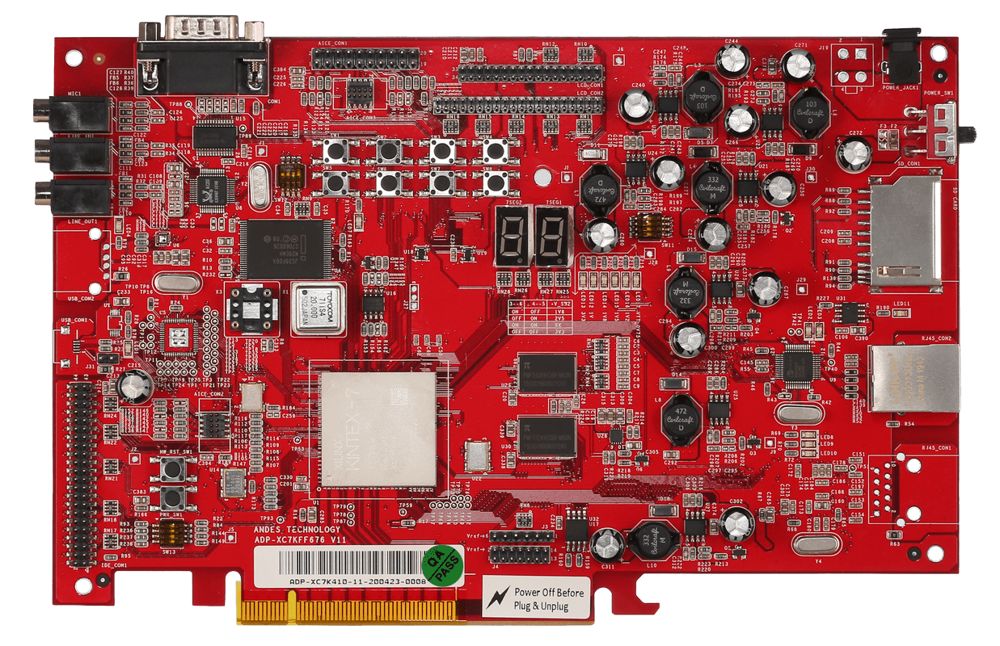
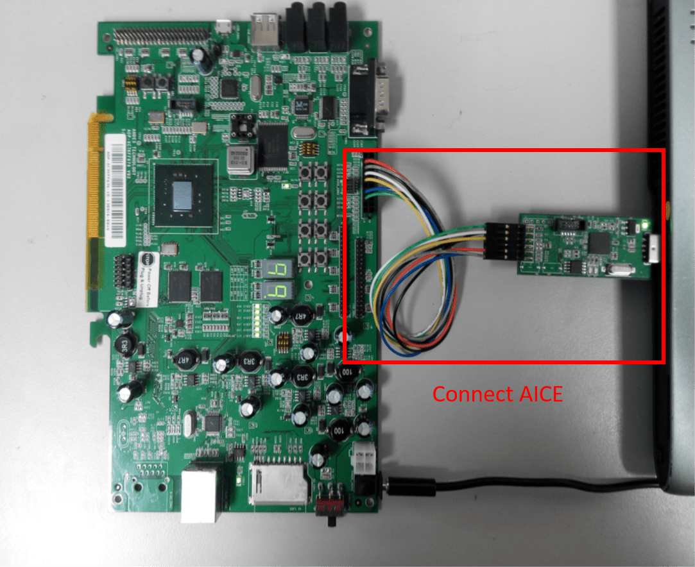

.. adp_xc7k_ae350:

Andes ADP-XC7K AE350
####################

Overview
********
ADP-XC7K series is a multi-purpose development and prototyping board that
provides rich capacity for evaluation of variety of AndesCore processors and
AndeShape SoC platform IPs.It also utilizes Xilinx Kintex 7 FPGA built-in
hi-speed I/Os to support DDR3* and PCI-E interface for better system performance.

AndeShape AE350 platform is deployed on the ADP-XC7K board by default for this
board configuration. The AE350 AXI/AHB-based platform N25(F)/NX25(F)/D25F/A25/
AX25/A27/A27L2/AX27/AX27L2 and 45-series CPU with level-one memories, interrupt
controller, debug module, AXI and AHB Bus Matrix Controller, AXI-to-AHB Bridge
and a collection of fundamental AHB/APB bus IP components pre-integrated
together as a system design.

Figure 1 shows the green PCB is ADP-XC7K160 and Figure 2 shows the red PCB is ADP-XC7K410.

.. figure:: img/adp_xc7k160.png
     :width: 442px
     :align: center
     :alt: ADP-XC7K160

More information can be found on `ADP-XC7K160/410`_ and `AndeShape AE350`_ websites.

Hardware
********

The ADP-XC7K board with AE350 SoC integrates a 60MHz 32-bit or 64-bit RISC-V CPU, DSP,
1GB RAM, SPI flash memory, and other peripherals.

The ADP-XC7K board with AE350 SoC provides following hardware components:

   - 32-bit or 64-bit AndeStar v5 RISC-V CPU
   - Memory

     - 1GB on-board SDRAM
     - 2MB SPI flash memory (1MB can be used for XIP)

   - Peripherals

     - UART
     - I2C
     - SPI
     - GPIO
     - PWM
     - 10/100 Ethernet RJ45 port
     - LCD module connector
     - 16KB I2C EEPROM
     - SD memory card slot
     - MIC-in, Line-in, and Line-out with AC97 audio codec

Supported Features
==================

The adp_xc7k_ae350 board configuration supports the following hardware features:

+----------------+------------+----------------------+
| Interface      | Controller | Driver/Component     |
+================+============+======================+
| PLIC           | on-chip    | interrupt_controller |
+----------------+------------+----------------------+
| RISC-V Machine | on-chip    | timer                |
| Timer          |            |                      |
+----------------+------------+----------------------+
| GPIO           | on-chip    | gpio                 |
+----------------+------------+----------------------+
| UART           | on-chip    | serial               |
+----------------+------------+----------------------+

Other hardware features are not supported yet.

Connections and IOs
==================

The ADP-XC7K board with AE350 SoC has 1 GPIO controller. It providing 32 bits of IO.
It is responsible for pin input/output, pull-up, etc.

Mapping from GPIO controller to the ADP-XC7K Board pins:

Buttons

* GPIO.0 = sw1
* GPIO.1 = sw2
* GPIO.2 = sw3
* GPIO.3 = sw4
* GPIO.4 = sw5
* GPIO.5 = sw6
* GPIO.6 = sw7
* GPIO.7 = sw8

7-SEG LED

* GPIO.16 = 7SEG1.A
* GPIO.17 = 7SEG1.B
* GPIO.18 = 7SEG1.C
* GPIO.19 = 7SEG1.D
* GPIO.20 = 7SEG1.E
* GPIO.21 = 7SEG1.F
* GPIO.22 = 7SEG1.G
* GPIO.23 = 7SEG1.P
* GPIO.24 = 7SEG2.A
* GPIO.25 = 7SEG2.B
* GPIO.26 = 7SEG2.C
* GPIO.27 = 7SEG2.D
* GPIO.28 = 7SEG2.E
* GPIO.29 = 7SEG2.F
* GPIO.30 = 7SEG2.G
* GPIO.31 = 7SEG2.P

GPIO

* GPIO.8 = IDE_CON1.6
* GPIO.9 = IDE_CON1.8
* GPIO.10 = IDE_CON1.10
* GPIO.11 = IDE_CON1.11
* GPIO.12 = IDE_CON1.12
* GPIO.13 = IDE_CON1.13
* GPIO.14 = IDE_CON1.14
* GPIO.15 = IDE_CON1.15

Other peripheral mapping are listed below:

SPI

* SPI_2_CS = IDE_CON1.37
* SPI_2_MOSI = IDE_CON1.36
* SPI_2_MISO = IDE_CON1.38
* SPI_2_SCLK = IDE_CON1.35

I2C

* I2C_SDA = J27.1
* I2C_SCL = J27.2

System Clock
------------

The ADP-XC7K AE350 SoC has 60MHz core clock.

Serial Port
-----------

The ADP-XC7K AE350 SoC has 2 UARTs.
The Zephyr console output is by default assigned to UART2 and the default
settings are 115200 8N1.

Programming and debugging
*************************

For debugging zephyr applications or burning them to a flash, you will need to
execute the Andes ICE management software, ICEman, on a host computer that's
connected with ADP-XC7K Board.

Connecting Andes ICE(AICE)
==========================

AICE is used for flashing and debugging the board. Please connect AICE to both
ADP-XC7K board and the host computer like Figure 3.

**Figure 3. Connect AICE**

More information can be found on `AICE-MINI+`_, `AICE-MICRO`_ website

Building
========

You can build applications in the usual way. Here is an example for
the "hello_world" application.

.. zephyr-app-commands::
   :board: adp_xc7k_ae350
   :goals: build

Flashing
========

With Andes ICE management software “ICEman” that interfaces with the JTAG
connector on the ADP-XC7K board, the toolchain can be used with the GNU Debugger
(GDB) for debugging, and the burner can burn the binary to flash.

Before flashing, we have to download and set up ICEman. You can download it from
`AWS development tools`_. To set up ICEman, please refer `set up ICEman`_.

If your program is built for executing in place, you need download the package
`amazon-freertos`_, and use burner in "<amazon-freertos>/vendors/andes/tools/"
folder.

If CONFIG_XIP=n, you can load the program (zephyr.elf) into RAM directly.

.. code-block:: console

   ./ICEman -Z v5
   ./riscv64-zephyr-elf-gdb zephyr/zephyr.elf
   (gdb) target remote :1111
   (gdb) monitor reset halt
   (gdb) load
   (gdb) quit

If CONFIG_XIP=y, you need to burn the program (zephyr.bin) into flash memory.

.. code-block:: console

   ./ICEman -Z v5
   ./target_burn_linux.sh <zephyr_application_build_folder>/zephyr/zephyr.bin

Open a serial terminal with the following settings:

- Speed: 115200
- Data: 8 bits
- Parity: None
- Stop bits: 1

you should see the following message in the terminal:

.. code-block:: console

   ***** Booting Zephyr OS v2.4.0 *****
   Hello World! adp_xc7k_ae350

Debugging
=========

.. code-block:: console

   ./ICEman -Z v5
   ./riscv64-zephyr-elf-gdb zephyr/zephyr.elf
   (gdb) target remote :1111
   (gdb) monitor reset halt
   (gdb) load

If CONFIG_XIP=y, please follow the flashing section to burn the program into
flash memory first.
Then, you can also use GDB/ICEman to debug without need of GDB `load` command.

References
**********

.. target-notes::

.. _ADP-XC7K160/410: http://www.andestech.com/en/products-solutions/andeshape-platforms/adp-xc7k160-410/

.. _AndeShape AE350: http://www.andestech.com/en/products-solutions/andeshape-platforms/ae350-axi-based-platform-pre-integrated-with-n25f-nx25f-a25-ax25/

.. _AICE-MINI+: http://www.andestech.com/en/products-solutions/andeshape-platforms/aice-mini/

.. _AICE-MICRO: http://www.andestech.com/en/products-solutions/andeshape-platforms/aice-micro/

.. _AWS development tools: https://github.com/andestech/aws_development_tools

.. _set up ICEman: https://github.com/andestech/amazon-freertos/blob/master/vendors/andes/boards/corvette_f1_n25/Getting_Started_Guide_Corvette-F1_N25.md#set-up-iceman

.. _amazon-freertos: https://github.com/andestech/amazon-freertos
